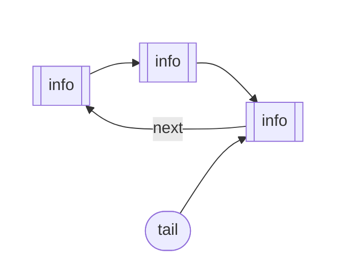

# Liste Circolari (Circular Linked List)

Una lista circolare è una variante della lista concatenata in cui l'ultimo nodo non punta a `nullptr`, ma punta nuovamente al primo nodo della lista, creando appunto un ciclo.

### Idea

Immagina un gruppo di persone sedute in cerchio che si tengono per mano. Non c'è una "fine" vera e propria; partendo da un punto qualsiasi e continuando a seguire i collegamenti, tornerai al punto di partenza.

**Caratteristiche principali:**
- Non esiste un nodo il cui puntatore `next` sia `nullptr`.
- Può essere **singola** (ogni nodo punta al successivo) o **doppia** (ogni nodo punta al successivo e al precedente).
- Spesso si utilizza un puntatore all'ultimo elemento (`tail`) invece che alla `head`, poiché `tail->next` ci dà accesso immediato alla testa.



## Struct

La struttura del nodo è identica a quella di una lista semplice:

```cpp
struct Cella {
    int info;
    Cella* next;
};
```

## Inserimento in Testa

In una lista circolare gestita tramite `tail`, l'inserimento in testa è molto efficiente ($O(1)$).

```cpp
void insertFront(Cella*& tail, int valore) {
    Cella* nuovo = new Cella;
    nuovo->info = valore;

    if (tail == nullptr) {
        // Lista vuota: il nodo punta a se stesso
        nuovo->next = nuovo;
        tail = nuovo;
    } else {
        // Il nuovo nodo punta alla vecchia testa (tail->next)
        nuovo->next = tail->next;
        // La coda punta al nuovo nodo (che diventa la nuova testa)
        tail->next = nuovo;
    }
}
```

## Scorrimento della Lista

Bisogna fare attenzione a non finire in un loop infinito. Una tecnica comune è usare un puntatore d'appoggio e fermarsi quando si torna alla testa.

```cpp
void stampaLista(Cella* tail) {
    if (tail == nullptr) return;

    Cella* curr = tail->next; // Partiamo dalla testa
    do {
        cout << curr->info << " -> ";
        curr = curr->next;
    } while (curr != tail->next); 
    cout << "(torna all'inizio)" << endl;
}
```

## Cancellazione di un Elemento (con valore `n`)

Funzione per eliminare il primo nodo che contiene il valore `n`.

```cpp
void deleteNode(Cella*& l, int n) {
    if (l == nullptr) return; // Lista vuota

    Cella* curr = l->next; // Testa
    Cella* prev = l;       // Coda

    do {
        if (curr->info == n) {
            if (curr == l && curr->next == l) {
                // Caso unico nodo
                l = nullptr;
            } 
            else if (curr == l) {
                // Caso eliminazione coda
                prev->next = curr->next;
                l = prev; 
            }
            else {
                // Caso generico
                prev->next = curr->next;
            }
            delete curr;
            return;
        }
        prev = curr;
        curr = curr->next;
    } while (curr != l->next);
}
```

## Rimozione in Coda (Fine)

Se l'obiettivo è eliminare l'ultimo elemento e salvare il suo valore in `n`:

```cpp
void eliminaFine(Cella*& l, int& n) {
    if (l == nullptr) return;

    Cella* testa = l->next;
    n = l->info; // Salvo il valore prima di eliminare

    if (testa == l) {
        delete l;
        l = nullptr;
    } else {
        Cella* curr = testa;
        while (curr->next != l) {
            curr = curr->next;
        }
        curr->next = testa;
        delete l;
        l = curr;
    }
}
```

## Vantaggi e Casi d'Uso

1. **Accesso alla Testa e Coda**: Se abbiamo un puntatore a `tail` (o `l`), l'accesso sia alla coda che alla testa (`l->next`) è $O(1)$.
2. **Applicazioni Real-time**: Algoritmi di scheduling (Round Robin).
3. **Buffer Circolari**: Gestione streaming.

## Operazioni Comuni

| Operazione | Complessità | Note |
| :--- | :--- | :--- |
| Inserimento in testa | $O(1)$ | Con puntatore alla coda |
| Rimozione coda | $O(n)$ | Richiede scorrimento fino al penultimo |
| Ricerca | $O(n)$ | Gestione ciclo necessaria |


``` cpp

void eliminaFine(Cella*& l, int& n) {
    2     // Caso 0: Lista vuota
    3     if (l == nullptr) return;
    4
    5     // Caso 1: Un solo elemento
    6     if (l->next == nullptr) {
    7         n = l->info;      // Salvo il valore
    8         delete l;         // Dealloco l'unico nodo
    9         l = nullptr;      // La lista ora è vuota
   10     } 
   11     // Caso 2: Più elementi
   12     else {
   13         Cella* curr = l;
   14         // Scorro fino al penultimo nodo
   15         // (quello il cui "prossimo del prossimo" è nullptr)
   16         while (curr->next->next != nullptr) {
   17             curr = curr->next;
   18         }
   19         
   20         n = curr->next->info; // Salvo il valore dell'ultimo nodo
   21         delete curr->next;    // Elimino l'ultimo nodo
   22         curr->next = nullptr; // Il penultimo diventa l'ultimo
   23     }
   24 }
```