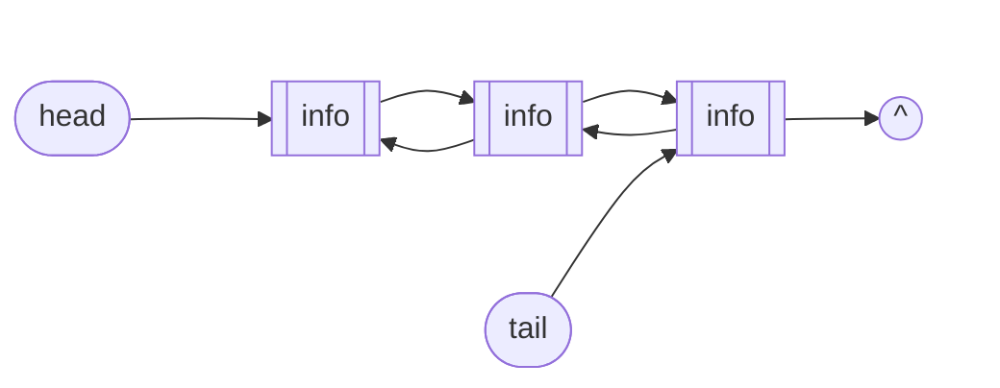

# Doubly Linked List

Una lista doppiamente concatenata è una lista in cui è possibile andare avanti e indietro.

### Idea

Supponiamo di avere una fila di persone in cui ogni persona tiene per mano sia quella davanti sia quella dietro.

Ogni nodo contiene:
- il dato
- un puntatore al nodo precedente (`prev`)
- un puntatore al nodo successivo (`next`)

Per scorrere la lista:
- **In avanti**: si parte dalla `head` e si segue `next` fintanto che non si arriva a `nullptr`.
- **All'indietro**: si parte da `tail` e si segue `prev` fintanto che non si arriva al primo nodo.



## Struct

La **struct** dei nodi di una lista doppiamente concatenata contiene il dato e due puntatori:

```cpp
struct Cella {
    int info;
    Cella* next;
    Cella* prev;
};
```

## Costruttore

```cpp
ListDL::ListDL() {
    head = nullptr;
    tail = nullptr;
}
```

## Distruttore

```cpp
ListDL::~ListDL() {
    Cella* cur = head;
    while (cur != nullptr) {
        Cella* tmp = cur;
        cur = cur->next;
        delete tmp;
    }
    head = nullptr;
    tail = nullptr;
}
```

## Copy constructor

```cpp
ListDL::ListDL(const ListDL& other) {
    // caso lista sorgente vuota
    if (other.head == nullptr) {
        head = nullptr;
        tail = nullptr;
        return;
    }

    // copia del primo nodo
    Cella* curr = other.head;
    head = new Cella{curr->info, nullptr, nullptr};
    tail = head;

    // copia dei nodi successivi
    curr = curr->next;
    while (curr != nullptr) {
        Cella* nu = new Cella{curr->info, nullptr, tail};
        tail->next = nu;   // collega avanti
        tail = nu;         // aggiorna tail
        curr = curr->next;
    }
}
```

## Prepend

```cpp
void ListDL::prepend(int n) {
    Cella* pc = new Cella{n, head, nullptr};
    if (head == nullptr) {
        head = pc;
        tail = pc;
    } else {
        head->prev = pc;
        head = pc;
    }
}
```

## Append

```cpp
void ListDL::append(int n) {
    Cella* pc = new Cella{n, nullptr, tail};
    if (tail == nullptr) {
        head = pc;
        tail = pc;
    } else {
        tail->next = pc;
        tail = pc;
    }
}
```

## Remove (iterativa)

```cpp
void ListDL::remove(int pos) {
    if (head == nullptr || pos < 0) return;  // lista vuota o posizione invalida

    Cella* pc = head;
    int i = 0;
    while (i < pos && pc != nullptr) {
        i++;
        pc = pc->next;
    }
    if (pc == nullptr) return;  // posizione fuori dalla lista

    // aggiorna il link precedente
    if (pc->prev == nullptr) {
        head = pc->next;
    } else {
        pc->prev->next = pc->next;
    }

    // aggiorna il link successivo
    if (pc->next == nullptr) {
        tail = pc->prev;
    } else {
        pc->next->prev = pc->prev;
    }

    delete pc;
}
```

## Remove (ricorsiva)

Metodo pubblico che lancia la ricorsione:

```cpp
void ListDL::remove_rec(int pos) {
    remove_rec(head, tail, pos);
}
```

Funzione ausiliaria ricorsiva:

```cpp
void ListDL::remove_rec(Cella*& curr, Cella*& t, int pos) {
    if (curr == nullptr) return;

    if (pos == 0) {
        Cella* tmp = curr;
        curr = curr->next;
        if (curr != nullptr) {
            curr->prev = tmp->prev;
        } else {
            t = tmp->prev;
        }
        delete tmp;
    } else {
        remove_rec(curr->next, t, pos - 1);
    }
}
```