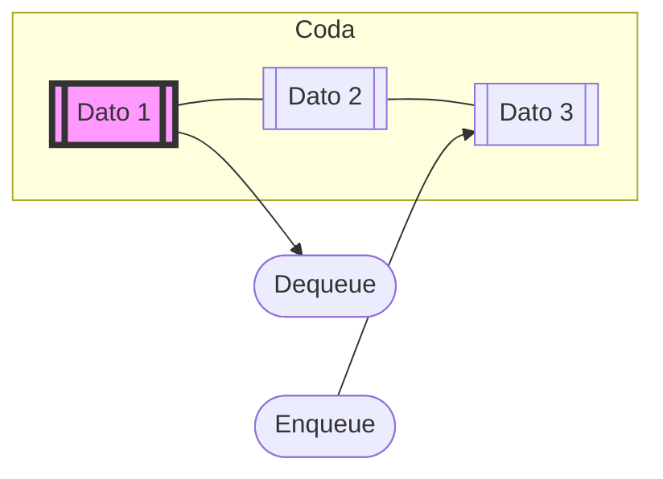

# Queue (Coda)

La **Queue** è una struttura dati lineare che segue il principio **FIFO** (*First In, First Out*): il primo elemento inserito è il primo a essere rimosso.

### Idea

Immagina una fila alla cassa di un supermercato: la prima persona che arriva è la prima ad essere servita, mentre i nuovi arrivati si mettono in fondo alla coda.



## Operazioni Fondamentali

Le operazioni principali di una queue sono:
1. **Enqueue**: Aggiunge un elemento in fondo (tail).
2. **Dequeue**: Rimuove l'elemento in testa (head).
3. **Front**: Restituisce l'elemento in testa senza rimuoverlo.
4. **isEmpty**: Controlla se la coda è vuota.

## Implementazione con Liste Concatenate

Per gestire efficientemente sia l'inserimento in fondo che la rimozione in testa ($O(1)$), è ideale usare due puntatori: `head` e `tail`.

```cpp
struct Nodo {
    int info;
    Nodo* next;
};

struct Queue {
    Nodo* head = nullptr;
    Nodo* tail = nullptr;

    // Enqueue: Inserimento in fondo (O(1))
    void enqueue(int valore) {
        Nodo* nuovo = new Nodo;
        nuovo->info = valore;
        nuovo->next = nullptr;

        if (isEmpty()) {
            head = tail = nuovo;
        } else {
            tail->next = nuovo;
            tail = nuovo;
        }
    }

    // Dequeue: Rimozione dalla testa (O(1))
    void dequeue() {
        if (!isEmpty()) {
            Nodo* temp = head;
            head = head->next;
            delete temp;
            
            // Se la coda è diventata vuota, resetto anche tail
            if (head == nullptr) {
                tail = nullptr;
            }
        }
    }

    // Front: Accesso al primo elemento (O(1))
    int front() {
        if (!isEmpty()) return head->info;
        return -1; // O gestione errore
    }

    bool isEmpty() {
        return head == nullptr;
    }
};
```

## Casi d'Uso

- **Gestione di risorse condivise**: Code di stampa, gestione dei processi nella CPU (Ready Queue).
- **Buffer di dati**: Trasmissione pacchetti in rete, gestione di eventi (Event Loop).
- **Algoritmi di visita**: Come la Breadth-First Search (BFS) nei grafi.
- **Sistemi di messaggistica**: Code di messaggi tra diversi servizi.

## Complessità

| Operazione | Complessità |
| :--- | :--- |
| Enqueue | $O(1)$ |
| Dequeue | $O(1)$ |
| Front | $O(1)$ |
| Ricerca | $O(n)$ |
