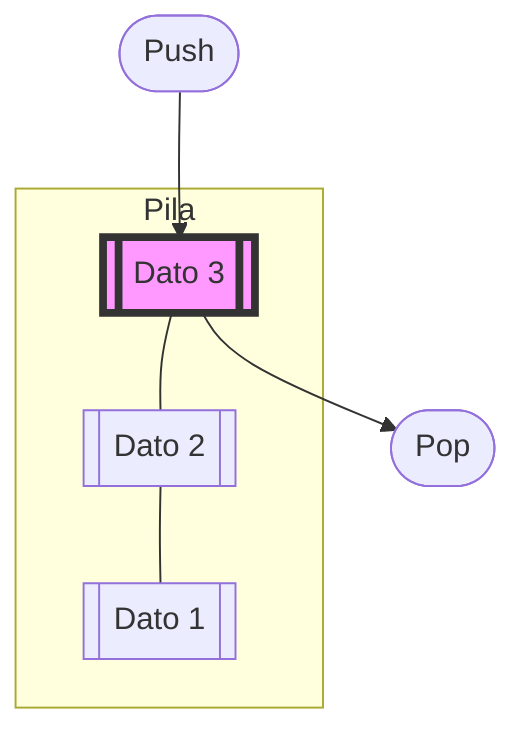

# Stack (Pila)

Lo **Stack** è una struttura dati lineare che segue il principio **LIFO** (*Last In, First Out*): l'ultimo elemento inserito è il primo a essere rimosso.

### Idea

Immagina una pila di piatti: puoi aggiungere un piatto solo in cima alla pila e, se vuoi prenderne uno, devi rimuovere quello che sta sopra a tutti gli altri.



## Operazioni Fondamentali

Le operazioni principali di uno stack sono:
1. **Push**: Aggiunge un elemento in cima.
2. **Pop**: Rimuove l'elemento in cima.
3. **Top (o Peek)**: Restituisce l'elemento in cima senza rimuoverlo.
4. **isEmpty**: Controlla se la pila è vuota.

## Implementazione con Liste Concatenate

L'implementazione con lista concatenata è dinamica e non richiede di conoscere la dimensione massima in anticipo.

```cpp
struct Nodo {
    int info;
    Nodo* next;
};

struct Stack {
    Nodo* head = nullptr;

    // Push: Inserimento in testa (O(1))
    void push(int valore) {
        Nodo* nuovo = new Nodo;
        nuovo->info = valore;
        nuovo->next = head;
        head = nuovo;
    }

    // Pop: Rimozione dalla testa (O(1))
    void pop() {
        if (head != nullptr) {
            Nodo* temp = head;
            head = head->next;
            delete temp;
        }
    }

    // Top: Accesso al valore in cima (O(1))
    int top() {
        if (head != nullptr) return head->info;
        return -1; // O gestione errore
    }

    bool isEmpty() {
        return head == nullptr;
    }
};
```

## Casi d'Uso

- **Gestione delle chiamate a funzione**: Lo "Stack dei record di attivazione" nel runtime dei linguaggi di programmazione.
- **Undo/Redo**: Negli editor di testo per annullare le ultime azioni.
- **Parsing di espressioni**: Per bilanciare le parentesi o valutare espressioni in notazione postfissa.
- **Algoritmi di visita**: Come la Depth-First Search (DFS) nei grafi.

## Complessità

| Operazione | Complessità |
| :--- | :--- |
| Push | $O(1)$ |
| Pop | $O(1)$ |
| Top | $O(1)$ |
| Ricerca | $O(n)$ |
